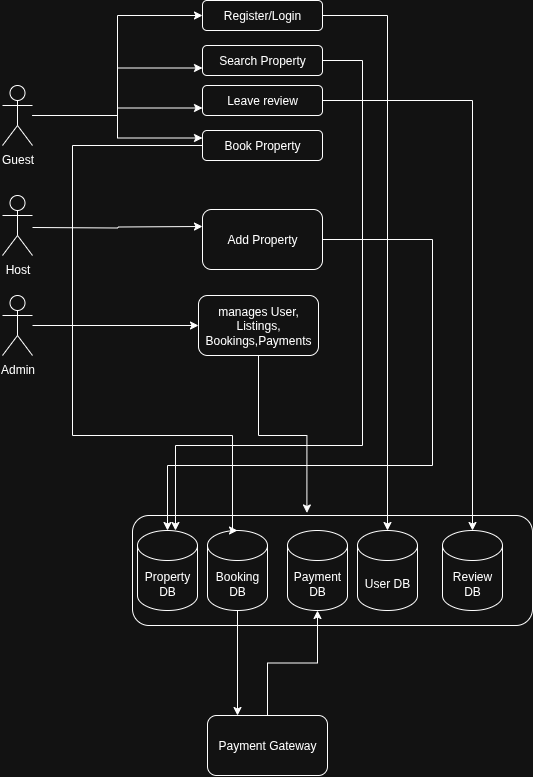

# Airbnb Clone Backend – Data Flow Diagram (DFD)

This document illustrates the **Data Flow Diagram (DFD)** for the Airbnb Clone backend, showing how data moves through the system between users, processes, and databases.

---

## Objective
Map the flow of data for the core backend functionalities:
- User Management
- Property Listings
- Booking System
- Payments
- Reviews
- Admin Management

---

## Entities
- **Guest** – Registers, searches properties, makes bookings, leaves reviews.  
- **Host** – Manages property listings and booking requests.  
- **Admin** – Oversees users, listings, bookings, and payments.  
- **Payment Gateway** – Handles external payment processing.  

---

## Processes & Data Stores
1. **User Management** → [Users Database]  
2. **Property Management** → [Properties Database]  
3. **Booking Management** → [Bookings Database]  
4. **Payment Processing** → [Payments Database]  
5. **Review System** → [Reviews Database]  
6. **Admin Management** → [All Databases]  

---

## Data Flow Diagram

Below is the diagram showing how data flows within the system:

