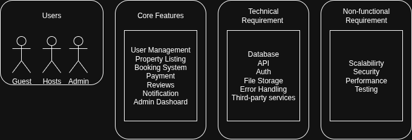

# Airbnb Clone Backend – Features and Functionalities

This document outlines the **backend requirements** for the Airbnb Clone project, covering the key features, technical requirements, and non-functional requirements.

---

## Objective
Identify and document the key features and functionalities necessary to build a scalable, secure, and robust backend for the Airbnb Clone project.

---

## Core Functionalities

### 1. User Management
- **User Registration:** Guests and Hosts can sign up.
- **Login & Authentication:** Email/password and OAuth (Google, Facebook).
- **Profile Management:** Update profile photos, contact info, and preferences.

### 2. Property Listings Management
- **Add Listings:** Title, description, location, price, amenities, availability.
- **Edit/Delete Listings:** Hosts can manage their properties.

### 3. Search and Filtering
- Search by location, price, guests, amenities.
- Pagination for large datasets.

### 4. Booking Management
- **Booking Creation:** Guests can book available dates.
- **Booking Cancellation:** Guests/hosts can cancel bookings.
- **Booking Status:** Pending, confirmed, canceled, completed.

### 5. Payment Integration
- Integration with Stripe/PayPal.
- Upfront guest payments & host payouts.
- Multi-currency support.

### 6. Reviews and Ratings
- Guests leave reviews and ratings.
- Hosts can respond.
- Reviews linked to bookings to prevent abuse.

### 7. Notifications System
- Email and in-app notifications for bookings, cancellations, and payments.

### 8. Admin Dashboard
- Manage **Users, Listings, Bookings, Payments**.

---

## 🛠️ Technical Requirements

1. **Database:** PostgreSQL/MySQL  
   - Users, Properties, Bookings, Reviews, Payments tables.  

2. **API Development:** RESTful APIs (+ optional GraphQL).  
   - GET, POST, PUT/PATCH, DELETE with proper status codes.  

3. **Authentication & Authorization:**  
   - JWT-based sessions.  
   - Role-based access control (Guest, Host, Admin).  

4. **File Storage:**  
   - AWS S3 or Cloudinary for property images & profile photos.  

5. **Third-Party Services:**  
   - Email notifications (SendGrid/Mailgun).  

6. **Error Handling & Logging:**  
   - Global API error handling.  

---

## Non-Functional Requirements

1. **Scalability:** Modular architecture, load balancing.  
2. **Security:** Encrypted passwords & payments, firewalls, rate limiting.  
3. **Performance:** Redis caching, optimized queries.  
4. **Testing:** Unit & integration tests (pytest), automated API testing.  

---

## System Design Diagram

Below is the diagram illustrating the **Airbnb Clone Backend Features and Functionalities**:

---

