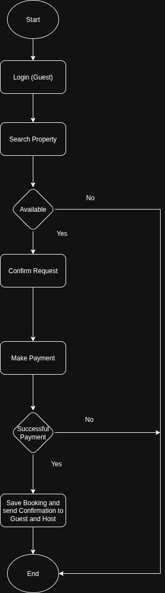

# Airbnb Clone Backend – Flowchart

This directory contains a **flowchart** that visualizes one of the key backend processes of the Airbnb Clone project.

---

## Objective
Map the workflow and processes of backend features to show step-by-step how data flows through the system.  

For this task, we illustrate the **Property Booking process**.

---

## Flowchart Description

1. Guest logs in to the system.  
2. Guest searches and selects a property.  
3. System checks property availability in the **Bookings Database**.  
   - If unavailable → System notifies guest (process ends).  
4. If available, guest confirms booking request.  
5. System sends payment request to the **Payment Gateway**.  
   - If payment fails → System notifies guest (process ends).  
6. If payment succeeds, system:  
   - Saves booking in the **Bookings Database**.  
   - Sends booking confirmation to both **Guest** and **Host**.  
7. Process ends successfully.  

---

## Flowchart

