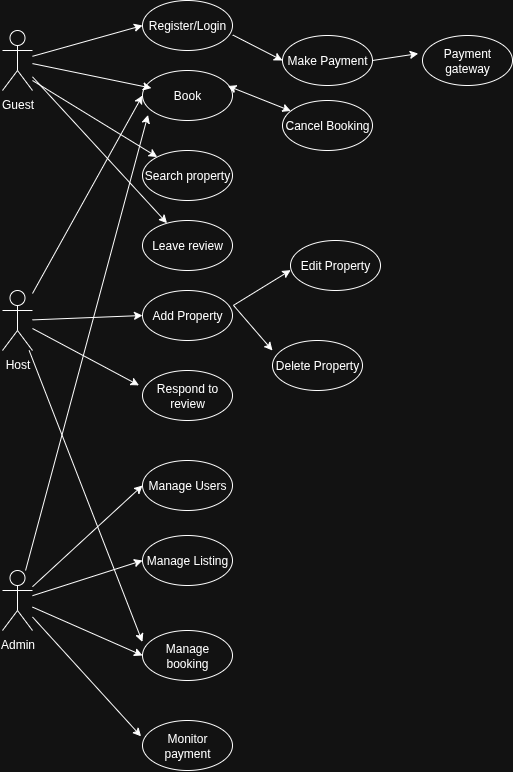

# Airbnb Clone Backend – Use Case Diagram

This document presents the **Use Case Diagram** for the Airbnb Clone backend system, showing how different users interact with the system’s functionalities.

---

## bjective
Visualize system interactions using a use case diagram, focusing on the key functionalities:
- User Registration & Authentication
- Property Management
- Booking & Payments
- Reviews & Notifications
- Admin Management

---

## Actors
- **Guest** – User who books properties.
- **Host** – User who lists and manages properties.
- **Admin** – System administrator managing the platform.
- **Payment Gateway** – External system for handling transactions.

---

## Key Use Cases
### Guest
- Register / Login  
- Search & Filter Properties  
- Book Property  
- Cancel Booking  
- Make Payment (via Payment Gateway)  
- Leave Review  

### Host
- Register / Login  
- Add Property Listing  
- Edit/Delete Property  
- Manage Bookings  
- Respond to Reviews  

### Admin
- Manage Users  
- Manage Listings  
- Manage Bookings  
- Monitor Payments  

### Payment Gateway
- Process Payments  
- Confirm Transactions  

---

## Use Case Diagram

Below is the diagram that illustrates all interactions:

